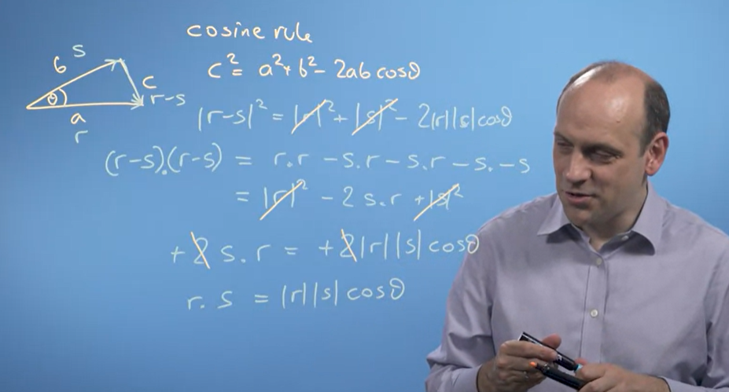

# Vector Basics - Dot Product

* * *

  

## **Vector Dot Product**

Mathmeticians define dot product between two vectors **v = \[a, b, c\]** and **w = \[x, y, z\]** to be as below. Hence, the two product always **return a single value**.

`v.dot(w) or w.dot(v) = ax + by + cz`  

  

### **Properties of Dot Product**

##### Ref.: [https://www.youtube.com/watch?v=ciLVJra\_jVA](https://www.youtube.com/watch?v=ciLVJra_jVA)

  

**Commutative** **\-** **v.dot(w)** is equal to **w.dot(v)** - It does not matter if you reverse the order

**Distributive over Addition** - **r.dot(s+t)** is equal to **r.dot(s) + r.dot(t)**

**Associative over Scalar Multiplication** \- Given that a is a scalar number,  **r.dot(as)** = **a(r.dot(s))**

  

> **Note:** This does not apply to matrix-matrix or matrix-vector multiplication. i.e., a.dot(b) is not the same as b.dot(a)!

  

### **Relationship Between Modulus and Dot Product**

**Modulus** is defined as the length of a vector. It is usually defined with **| |**, e.g., the modulus/ length of **vector v** is **|v|**

When a vector dot product with itself and then take the square root, it is equal to the modulus of the vector.

  

E.g., Imagine vector **v** is equal to **3i + 4j** - the dot product will be 3\*3+4\*4 = 25, which is the length of the vector after taking square root.

  

### **Relationship Between Cosine Rule and Dot Product**

##### Ref.: [https://www.youtube.com/watch?v=kkus5KHOLZQ](https://www.youtube.com/watch?v=kkus5KHOLZQ)

  

The mathematics **Cosine Rule** could derive into a formula that the dot product between 2 vectors is indeed the multiplication of the two's modulus with the **cosine(theta)**.

An intuition is that, if the two vectors is 90 degrees with each other, cosine(theta) will be 0 and hence the dot product.

  

  ********

  

* * *

## **Vector Projection**

There are 2 types of Projection - **Scalar Projection** and the **Vector Projection**. First, Imagine that there are two vectors **r** and **s**: 

  

### **Scalar Projection**

##### Ref.: [https://www.youtube.com/watch?v=iucKb-VSrRc](https://www.youtube.com/watch?v=iucKb-VSrRc)

  

Scalar Projection is more interpretable. Imagine that there is sunlight and it shines on 1 vector to make a projection/ shadow on another vector.

After Scalar Projection, it will **return a scalar value**.

  

**`r.dot(s)/|r|`** \= projection of s on r

**`r.dot(s)/|s|`** \= projection of r on s

  

  

### **Vector Projection**

##### Ref.: [https://www.youtube.com/watch?v=iucKb-VSrRc](https://www.youtube.com/watch?v=iucKb-VSrRc)

  

Vector Projection, according to definition, is that **after we computed the scalar projection**, we multiply the value by **the unit vector of the vector that's being projected on**.

After Vector Projection, it will return **a vector in the direction that is being projected on**.

  

  

* * *

## **Duality of Dot-Product**

##### Ref.: [https://www.youtube.com/watch?v=LyGKycYT2v0](https://www.youtube.com/watch?v=LyGKycYT2v0)

  

Take a look at the below illustration - a "**matrix-vector product that transform a vector into a number on the number line"** is indeed equal to the **dot-product with the vector**.

In other words, **the transformation into a 1d-space** is equal to **a vector in the space**

  

  

This is because when we think from the perspective of geometry, projection on the vector U will make i-hat and j-hat falls at the position of Ux and Uy:

  

  

  

**

* * *

**

## **Advanced Topic: Inner Product**

##### Ref.: [https://mathworld.wolfram.com/InnerProduct.html#:~:text=An%20inner%20product%20is%20a,satisfies%20the%20following%20four%20properties](https://mathworld.wolfram.com/InnerProduct.html#:~:text=An%20inner%20product%20is%20a%2Csatisfies%20the%20following%20four%20properties).

  

We define Inner Product as  "**Any vector muplication in a vector space that results in a scalar**". Therefore, it could be perceived as a **generalized term** for dot product.

Mathematically, inner product could be represented as **<v, w>** for vector **v** and **w**. An inner product poccess the below 3 qualities (which is the same as the properties of dot product mentioned above):

  

  

* * *

## **Advanced Topic:** **Projecting a Vector onto Higher-Dimensional Subspace**

In the above, we have mentioned how to project vector onto 1d subspace. Here, we would have a general formula to project a vector on high dimensional subspace - 

****  

  

### **How the Formula is Derived?**

****

  

  

### **Practical Example**

